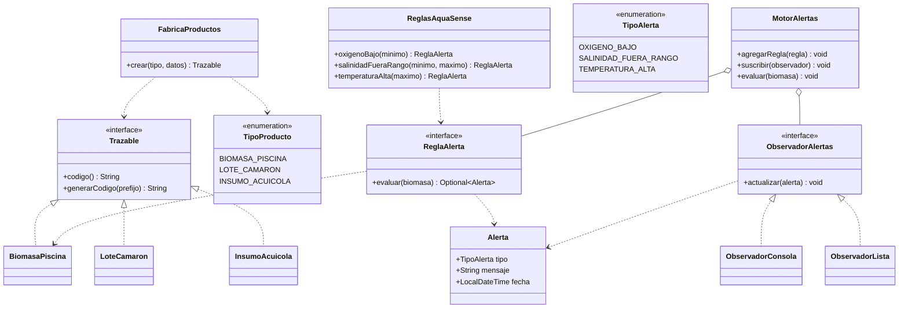

# Diagrama UML - AquaSense

```mermaid
classDiagram
    class Trazable {
        <<interface>>
        +codigo() String
        +generarCodigo(prefijo) String
    }

    class BiomasaPiscina
    class LoteCamaron
    class InsumoAcuicola

    Trazable <|.. BiomasaPiscina
    Trazable <|.. LoteCamaron
    Trazable <|.. InsumoAcuicola

    class TipoProducto {
        <<enumeration>>
        BIOMASA_PISCINA
        LOTE_CAMARON
        INSUMO_ACUICOLA
    }

    class FabricaProductos {
        +crear(tipo, datos) Trazable
    }

    FabricaProductos ..> TipoProducto
    FabricaProductos ..> Trazable

    class ReglaAlerta {
        <<interface>>
        +evaluar(biomasa) Optional~Alerta~
    }

    class ReglasAquaSense {
        +oxigenoBajo(minimo) ReglaAlerta
        +salinidadFueraRango(minimo, maximo) ReglaAlerta
        +temperaturaAlta(maximo) ReglaAlerta
    }

    ReglasAquaSense ..> ReglaAlerta
    ReglaAlerta ..> BiomasaPiscina
    ReglaAlerta ..> Alerta

    class Alerta {
        +TipoAlerta tipo
        +String mensaje
        +LocalDateTime fecha
    }

    class TipoAlerta {
        <<enumeration>>
        OXIGENO_BAJO
        SALINIDAD_FUERA_RANGO
        TEMPERATURA_ALTA
    }

    class ObservadorAlertas {
        <<interface>>
        +actualizar(alerta) void
    }

    class ObservadorConsola
    class ObservadorLista

    ObservadorAlertas <|.. ObservadorConsola
    ObservadorAlertas <|.. ObservadorLista

    class MotorAlertas {
        +agregarRegla(regla) void
        +suscribir(observador) void
        +evaluar(biomasa) void
    }

    MotorAlertas o-- ReglaAlerta
    MotorAlertas o-- ObservadorAlertas
    ObservadorAlertas ..> Alerta
```
